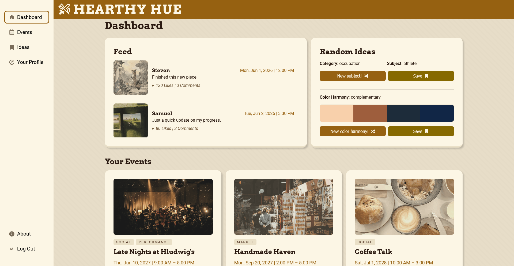
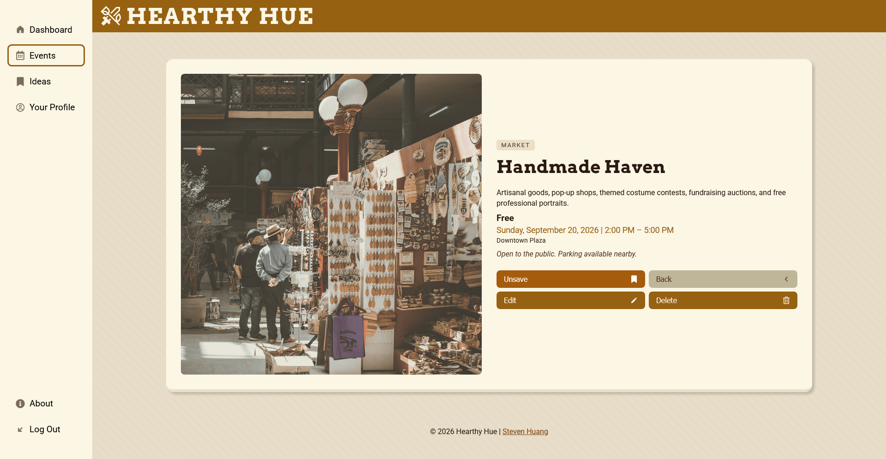
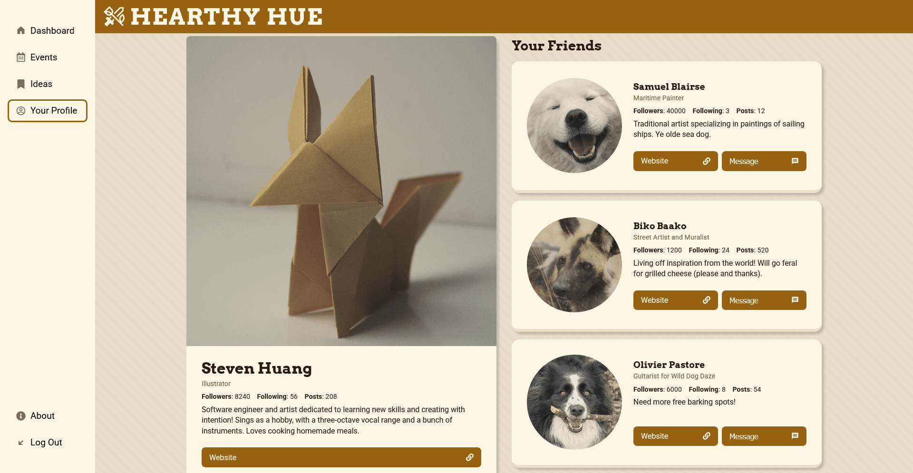
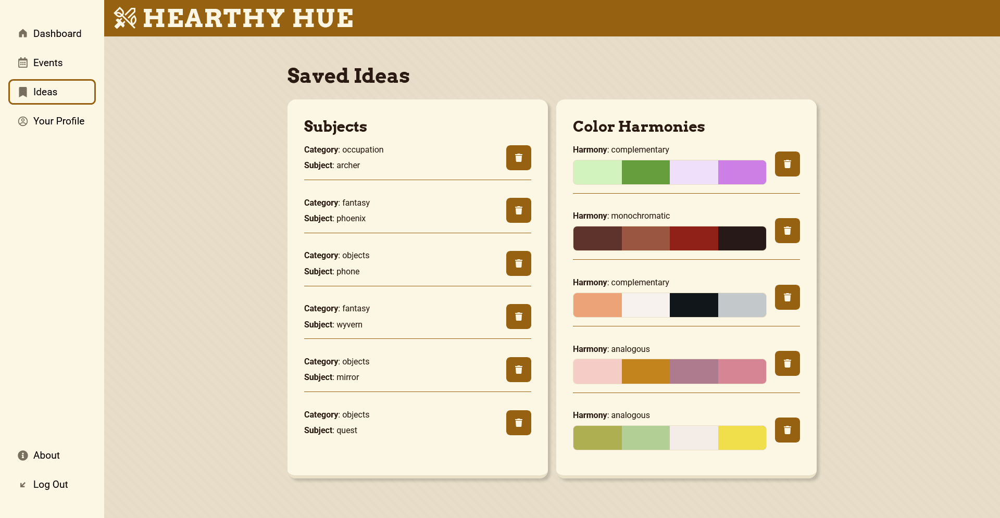
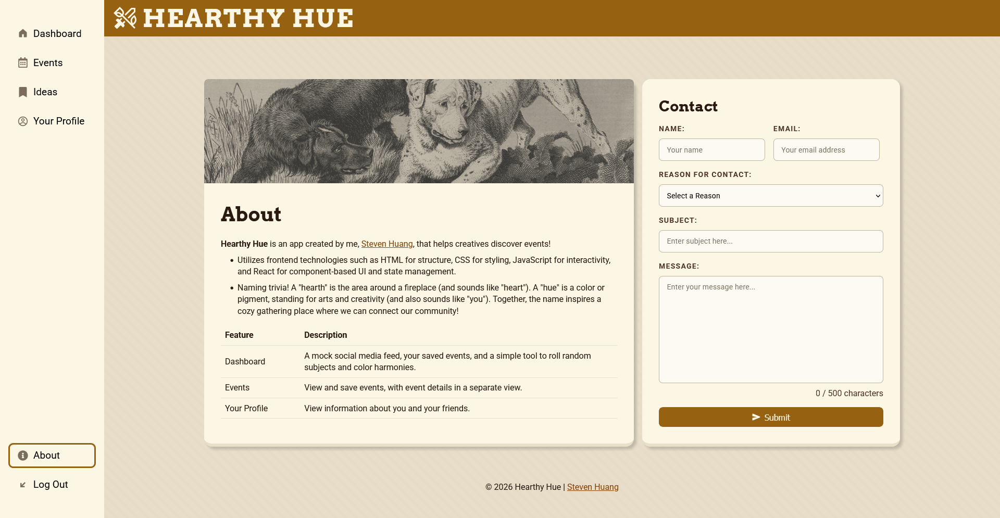
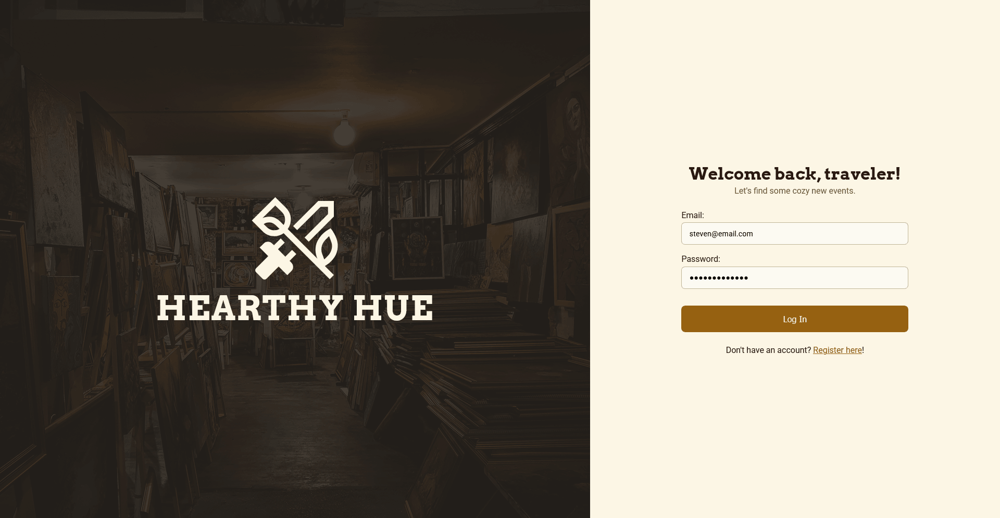
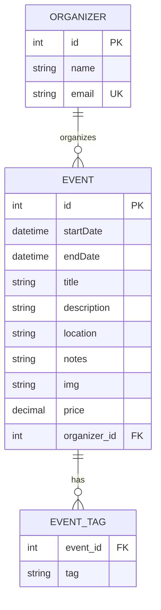
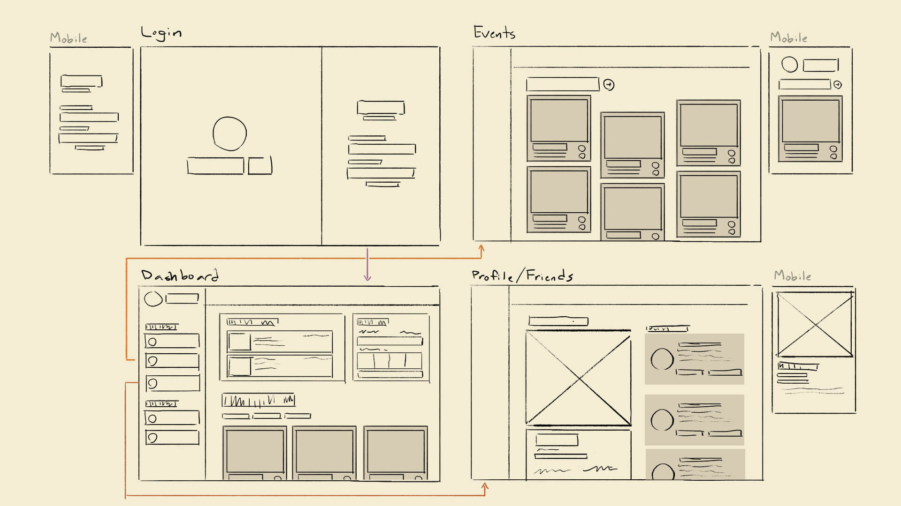

<div align="center">
  
  <h1>Hearthy Hue</h1>
  <p><strong>Let's find some cozy new events.</strong></p>
</div>

<div align="center">
    <a href="#about">About</a> •
    <a href="#features">Features</a> •
    <a href="#tech-stack">Tech Stack</a> •
    <a href="#reference">Reference</a> •
    <a href="#installation">Installation</a> •
    <a href="https://github.com/EvenStevenH/hearthy-hues" target="_blank">Source Code</a>

</div>

---

## About

**Hearthy Hue**, created by [Steven Huang](https://github.com/EvenStevenH), is a full-stack web application for people who want to discover welcoming, local activities such as workshops, exhibitions, markets, talks, and social gatherings. Users can browse and filter events, open a dedicated details view, save events for later, and use the dashboard's random idea and color harmony tools when they need a little creative inspiration. The frontend is a responsive React single-page application, and the backend is a Spring Boot REST API that persists events and organizers in MySQL. The project was built to demonstrate component-based UI design, React state and props, client-side routing, form validation, responsive CSS, RESTful CRUD operations, and the separation of frontend and backend responsibilities.

## Features

- Discover, save, filter, and perform CRUD operations on events! Fall back to local event data when the backend is unavailable, so a simulated experience remains available offline. A deployed, frontend-only demo is available at [evenstevenh.github.io/hearthy-hues](https://evenstevenh.github.io/hearthy-hues/)!

- Responsive layouts using flexbox, grid, and media queries to accommodate screen sizes. This is paired with semantic labels, image alternative text, loading states, empty states, and error messages.

- Get and save random drawing subjects and color harmonies for inspiration! These can be viewed on a dedicated route.

<br>

<div align="center">

| Events Page                                                                       |
| --------------------------------------------------------------------------------- |
|  |

</div>

<details>
<summary>Additional Screenshots</summary>

<div align="center">

| Dashboard                                                                        | Event Details                                                                                 |
| -------------------------------------------------------------------------------- | --------------------------------------------------------------------------------------------- |
|  |  |

| Profile                                                                           | Saved Ideas                                                                               |
| --------------------------------------------------------------------------------- | ----------------------------------------------------------------------------------------- |
|  |  |

| About Page                                                                    | Login Page                                                                    |
| ----------------------------------------------------------------------------- | ----------------------------------------------------------------------------- |
|  |  |

</div>

</details>

## Tech Stack

| Layer    | Technologies                                                                   | Role                                                                 |
| -------- | ------------------------------------------------------------------------------ | -------------------------------------------------------------------- |
| Frontend | React 19, JavaScript, React Router, Vite                                       | Component-based SPA, routing, state management, and build/dev server |
| UI/UX    | CSS, Framer Motion, React Icons                                                | Styling, responsive layout, transitions, and icons                   |
| Backend  | Java 21, Spring Boot, Maven, Spring Web MVC, Spring Data JPA, Hibernate, MySQL | REST API, ORM/persistence mapping, and relational data storage       |
| Quality  | ESLint, Vitest                                                                 | Static analysis and unit testing                                     |
|          |

## Reference

<details>
  <summary>API Endpoints</summary>

### Events

| Method   | Endpoint           | Description       |
| -------- | ------------------ | ----------------- |
| `GET`    | `/api/events`      | Return all events |
| `GET`    | `/api/events/{id}` | Return one event  |
| `POST`   | `/api/events`      | Create an event   |
| `PUT`    | `/api/events/{id}` | Update an event   |
| `DELETE` | `/api/events/{id}` | Delete an event   |

### Organizers

| Method   | Endpoint               | Description           |
| -------- | ---------------------- | --------------------- |
| `GET`    | `/api/organizers`      | Return all organizers |
| `GET`    | `/api/organizers/{id}` | Return one organizer  |
| `POST`   | `/api/organizers`      | Create an organizer   |
| `PUT`    | `/api/organizers/{id}` | Update an organizer   |
| `DELETE` | `/api/organizers/{id}` | Delete an organizer   |

### Example Event Payload

```json
{
	"startDate": "2026-06-10T09:00:00",
	"endDate": "2026-06-10T17:00:00",
	"title": "Watercolor on the Water",
	"description": "A relaxed painting session by the river.",
	"location": "Cherry Orchard Street Pier",
	"notes": "Bring a sketchbook and water-resistant supplies.",
	"img": "watercolor",
	"price": 25,
	"tags": ["painting", "workshop"],
	"organizer": {
		"id": 1
	}
}
```

</details>

<details>
  <summary>Data Model</summary>

The backend uses two JPA entities; `Event` and `Organizer`. An organizer can host many events (one-to-many), while each event belongs to one organizer. An event can have zero or more tags (one-to-many), and event tags are stored as an element collection in a separate join table.



</details>

<details>
    <summary>Development Notes</summary>

### Known Limitations / Future Features

- The login is a demo-only client-side check. A production version should use backend authentication, password hashing, sessions or tokens, and authorization.
- The deployed GitHub Pages frontend does not host the Spring Boot API. Full CRUD requires a separately running backend with a reachable MySQL database.
- The frontend API URL is currently hardcoded to `http://localhost:8080/api/events`; deployment should use an environment-based API URL.
- Contact form submissions are intentionally mocked and are not sent to a service.
- Event and organizer responses do not yet provide dedicated not-found or validation error payloads from the backend.
- Future feature ideas include production deployment of the API and database, environment-based configuration, user accounts, organizer ownership, search, pagination, event moderation, and integration of social media data from public APIs.

### Wireframes



</details>

<details>
    <summary>Project Structure</summary>

### Project

```text
hearthy-hues/
├── backend/
│   ├── src/main/java/com/stevenhuang/backend/
│   │   ├── config/          # CORS configuration
│   │   ├── controllers/     # REST controllers
│   │   ├── models/          # JPA entities
│   │   └── repositories/    # Spring Data repositories
│   ├── src/main/resources/
│   │   └── application.properties
│   └── pom.xml
├── frontend/
│   ├── src/
│   │   ├── components/      # reusable pages and UI components
│   │   ├── data/            # local data for feed, ideas, events, and images
│   │   ├── styles/          # Route and global stylesheets
│   │   ├── tests/           # test files
│   │   └── utils/           # API client, context, hooks, and helpers
│   ├── package.json
│   └── vite.config.js
└── README.md
```

### Routes

| Route                   | Purpose                                       |
| ----------------------- | --------------------------------------------- |
| `/login`                | Demo login and credential guidance            |
| `/dashboard`            | Feed, random creative tools, and saved events |
| `/events`               | Filterable event directory                    |
| `/events/:eventId`      | Event details and save/edit/delete actions    |
| `/events/new`           | Create an event                               |
| `/events/:eventId/edit` | Edit an event                                 |
| `/saved-ideas`          | Saved subjects and color harmonies            |
| `/user`                 | Profile and friends view                      |
| `/about`                | Project information and contact form          |

</details>

## Installation

### Prerequisites

> [!NOTE]
> To run this project locally, you'll need the following installed:
>
> - Node.js and npm
> - Java Development Kit (JDK) 21
> - MySQL Server (version 8.0 or later)
> - Git

### Setup

1.  In the terminal, navigate to where you want to store the project. Then, clone the repository and move into the project folder.

    ```shell
    git clone https://github.com/EvenStevenH/hearthy-hues.git
    cd hearthy-hues
    ```

2.  Configure MySQL by creating the database.

    ```sql
    CREATE DATABASE hearthy_hue;
    ```

3.  In `backend`, create an `.env` file containing these environment variables. Update with your MySQL credentials.

    ```properties
    MYSQL_URL=jdbc:mysql://localhost:3306/hearthy_hue
    MYSQL_USERNAME=your_mysql_username
    MYSQL_PASSWORD=your_mysql_password
    ```

4.  Start the backend. Hibernate will create the `events`, `organizers`, and `event_tags` tables for you. The API runs at `http://localhost:8080`.

    ```shell
    mvn spring-boot:run
    ```

5.  Using a tool like Postman, make a `POST` request to `http://localhost:8080/api/organizers` with this JSON body structure:

    ```json
    {
    	"email": "steven@email.com",
    	"name": "Steven Huang"
    }
    ```

> [!IMPORTANT]
> This creates an organizer with `"id": 1`. This exact id must exist in the table to perform event `POST` requests!

6.  Navigate to `frontend`, install dependencies, and run the React/Vite app.

    ```shell
    cd frontend
    npm install
    npm run dev
    ```

    Vite prints the local URL (normally `http://localhost:5173`). The frontend's API client targets `http://localhost:8080/api/events`, so keep the backend running for event CRUD operations. If the API cannot be reached, the app will use local data.
